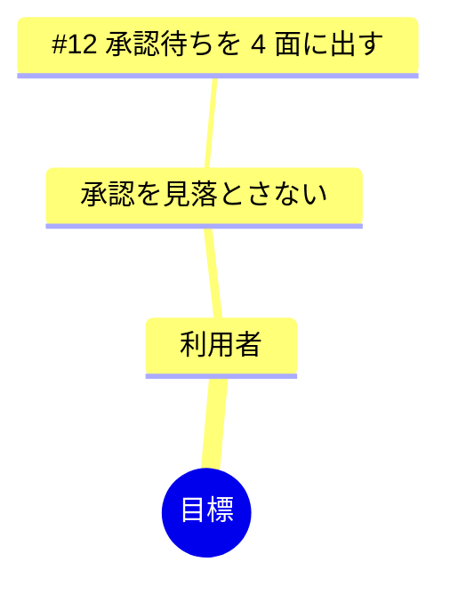

# Impact Mapping

「なぜ作るか」から Issue までを 1 本の木で繋ぐ。根が目標、枝が関係者（誰）、その先が影響（どう変わる）、
葉が成果物（何を作る = Issue）。**目標に繋がらない Issue が見つかる**のがこの資料の価値である。

## 読む

1. `docs/GOAL.md`（無ければ README）から目標を取る。書いていなければ人に「この期間の目標を 1 行で」と頼む
2. open な Issue を集める（`gh issue list --state open --limit 100 --json number,title,body`。通らなければ人に貼ってもらう）
3. 関係者は GOAL の利用者の定義から取る。無ければ「利用者」「作者」の 2 つから始める

## 作る

- 目標は 1 つ。測れる形で書く（「〜が〜になる」）
- 誰: 目標に影響する人・役。3〜5 個
- どう変わる: その人の行動がどう変わるか。動詞で書く
- 何を作る: Issue の番号と題名。1 つの Issue は 1 か所にだけ置く
- **どこにも繋がらない Issue は「繋がらない」の節に列挙する。** 消さない。捨てるかは人が決める

## 書く

`docs/plans/impact-map/YYYY-MM-DD.md` に書く（下の「版」）。mermaid の mindmap と、同じ内容の表の両方を置く（図は読み、表は検索する）。

```markdown
# Impact Map（YYYY-MM-DD）

前の版（YYYY-MM-DD）からの変更: ...

目標: ...



| 誰 | どう変わる | 何を作る |
| --- | --- | --- |

## 繋がらない
- #5 題名
```


## 版

**上書きしない。** 資料ごとに置き場を分け、日付つきの版を足す（利用者の指示、2026-09-11。資料の版を個別に追えるように）。

- 置き場: `docs/plans/<資料名>/`。版は `YYYY-MM-DD.md`（同じ日に 2 回なら `YYYY-MM-DD-2.md`）
- 前の版があれば読み、新しい版の冒頭に「前の版（日付）からの変更」を 3 行以内で書く。無ければ「最初の版」
- `docs/plans/<資料名>/README.md` に版の索引を置く（新しい順。日付と 1 行の要約）。無ければ作る
- 資料ごとの歴史は `git log -- docs/plans/<資料名>/` で追える。PR にするなら資料ごとに枝を切る（`docs/<資料名>`）

## 報告

パスと、「繋がらない」の件数を 1 行で言う。
