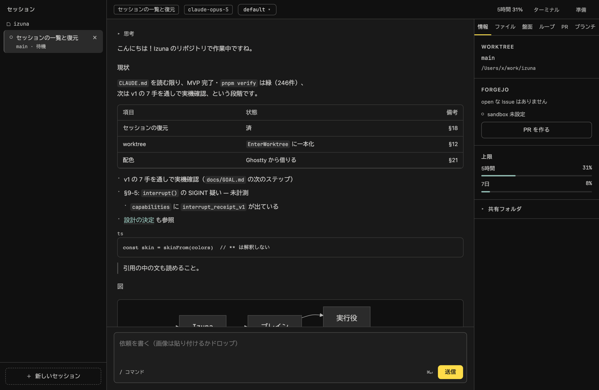

# Izuna

Claude Code を自分の Forgejo と一緒にデスクトップから使う macOS アプリ。
`claude` CLI をヘッドレスで駆動し、会話・思考・ツール実行・差分・承認を GUI で描く。
**自分の Forgejo を持っている人**のための道具 —— 実行役の荒れる作業は自宅の Forgejo（sandbox）で
PR にしてまとめて見て、GitHub（upstream）には仕上がったものだけを出す。

- **入れる**: [Releases](https://github.com/Watakumi/izuna/releases) の DMG（Apple Silicon）。署名していないので開き方は [docs/SETUP.md](docs/SETUP.md)
- **使うには**: [docs/SETUP.md](docs/SETUP.md)（Claude Code、Forgejo、gh。準備画面が判定する）
- **何を作るか**: [docs/GOAL.md](docs/GOAL.md)（三本の柱と、やらないこと）
- **どう作るか**: [CLAUDE.md](CLAUDE.md)（入口）と `.claude/rules/*.md`（触るファイルに応じて読まれる）、[docs/DECISIONS.md](docs/DECISIONS.md)（背景）
- **Nimbalyst との違い**: [docs/NIMBALYST.md](docs/NIMBALYST.md)。**Orca との違い**: [docs/ORCA.md](docs/ORCA.md)



画面は `pnpm shots` の作り物の記録で描いたもの（実 API は呼んでいない）。撮った日を書いてあるのは、
画面が変わっても画像だけ古いまま残るのを見つけるため（docs/ORCA.md §7 の 10）。
- **CI（自宅 Forgejo Actions）**: [docs/ACTIONS.md](docs/ACTIONS.md)

## 動かす

```bash
brew install gitleaks # pre-push の門（秘密の走査）。無いと push できない
pnpm install          # git hook と Electron 向けの再ビルドもここで
pnpm dev              # 開発。renderer は HMR、main は再起動が要る（CLAUDE.md §7）
pnpm verify           # 型検査・lint・検査（カバレッジの線つき）。緑でなければ進まない
pnpm run catchup      # claude が上がったら、SDK と fixture と版を揃える（熟成の線を越えるまでは止まる）
pnpm shots            # 実 renderer を作り物の window.izuna で撮る（§22）
pnpm e2e              # 本物の Electron を起動して口を叩く（§30）。要 build と Forgejo
pnpm walk             # v1 の 7 手を本物で通して撮る（§31）。実 API を呼び、GitHub と Forgejo に書く
pnpm build:mac        # DMG を作る。署名と公証は証明書があるときだけ（.github/workflows/release.yml）
```

`claude` は PATH かログインシェルから探す。無ければ `~/.izuna/config.json` の
`claudePath` で指す（CLAUDE.md §15）。

## 守っていること

- 承認は人が持つ。ブレインにも自動にも渡さない
- 保存層を持たない。`~/.claude/projects/` が真実
- 信頼していないリポジトリの hook と `.mcp.json` は、開く前に止める
- Forgejo の鍵はボットのもの。平文で LAN を通る経路には送らない
- 本文は木で描き、HTML を作らない（例外は mermaid の 1 か所だけ）

- 埋めた頁（PR のプレビュー）は Forgejo と GitHub だけ。node を切って sandbox
- 秘密は gitleaks が pre-push と CI で走査し、依存は osv-scanner が見る

詳しくは `.claude/rules/security.md`（§26）と `supply-chain.md`（§27）。
