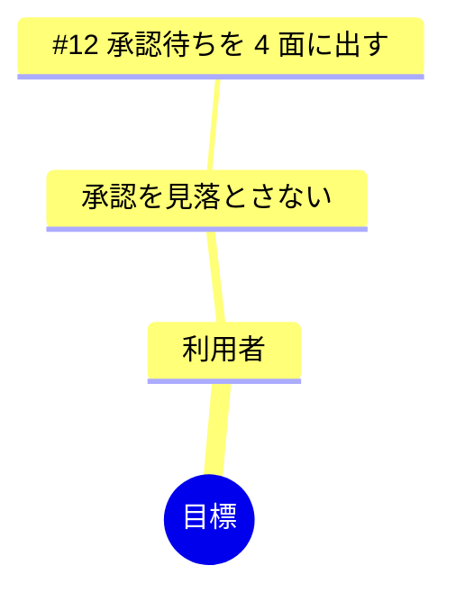

# Impact Mapping

「なぜ作るか」から Issue までを 1 本の木で繋ぐ。根が目標、枝が関係者（誰）、その先が影響（どう変わる）、
葉が成果物（何を作る = Issue）。**この資料の値打ちは、どこにも繋がらない Issue が出てくること**にある。
繋がらないものを消してはいけない —— 捨てるかは人が決める。

## いつ使い、いつ使わないか

使う:

- Issue は溜まっているが、何のために作っているかが薄れてきた
- 目標に効かない作業に時間を使っていないか確かめたい
- 関係者ごとに、何が変わるのかを人と揃えたい

使わない:

- **目標が言葉になっていないとき。** 人に 1 行で書いてもらってから使う
- **open な Issue が 0 件のとき。** 葉が無い木は作らない
- 順番だけ決めたいとき → `doc-now-next-later`
- 1 つの Issue を掘り下げたいとき → `doc-example-map`

## 手順の形式

順序つきの手順。**1 → 4 を飛ばさない。** 目標か Issue が無ければ 2 で止まる。

## 手順

### 1. 入力を集める

`../doc-shared/inputs.md` のとおり。要るのは 3 つ。

- 目標。`docs/GOAL.md`（無ければ `README.md`）から取る。**測れる形で 1 行**
- `gh issue list --state open --limit 100 --json number,title,body`
- 関係者。GOAL の利用者の定義から取る。無ければ「利用者」「作者」の 2 つから始める

### 2. 入力が足りるかを見る（**止まる判断**）

| 見るもの | 足りない | どうするか |
| --- | --- | --- |
| 目標 | 文書に無い | 人に「この期間の目標を 1 行で、測れる形で」と聞く。**自分で決めない** |
| Issue の件数 | **0 件** | 作らない。`gh` は 0 件でも `[]` を返して成功するので、件数を見る |
| 関係者 | 決められない | 「利用者」「作者」で始め、資料にそう書く |

### 3. 木にする

- **目標**は 1 つ。「〜が〜になる」の形。複数あるなら資料を分ける
- **誰**: 目標に影響する人・役。3〜5 個。多いと木が読めなくなる
- **どう変わる**: その人の**行動が**どう変わるか。動詞で書く（「速くなる」ではなく「承認を見落とさなくなる」）
- **何を作る**: Issue の番号と題名。1 つの Issue は木の 1 か所にだけ置く
- **繋がらない Issue は「繋がらない」の節に列挙する。** 消さない

葉が 1 つも無い枝は、**やることが決まっていない影響**である。そう書いて残す。

### 4. 書く

`../doc-shared/versioning.md` のとおり版を足す。置き場は `docs/plans/impact-map/`。
図と表の**両方**を置く —— 図は読み、表は検索する。

````markdown
# Impact Map（YYYY-MM-DD）

前の版（YYYY-MM-DD）からの変更: ...

目標: ...



| 誰 | どう変わる | 何を作る |
| --- | --- | --- |

## 繋がらない
- #5 題名 — （なぜ繋がらないか）
````

## 適用範囲

- **出どころ**: Impact Mapping は Gojko Adzic の形。目標 → アクター → インパクト → 成果物の 4 段
- **対象**: 目標が言葉になっていて、Issue がある git のリポジトリ
- **当てはまらなくなる条件**:
  - 目標が複数ある（木が 1 本にならない。資料を分ける）
  - 関係者が社外に広がる（GOAL から取れない。人に聞く）
  - Issue が数百件ある（葉が多すぎて木が読めない。絞り方は測っていない）
- **確かめた環境**: Izuna のリポジトリ、2026-09-11。mermaid の `mindmap` が Izuna の画面で描けることは
  `shared/markdown.ts` の経路で確かめている（他の道具では描けないことがある）

## 実行後に確かめる

```bash
ls docs/plans/impact-map/
```

- 入力にあった Issue が、木か「繋がらない」に**ちょうど 1 度ずつ**出る（数が合う）
- 目標が 1 つだけ書かれている
- 「どう変わる」が全部**動詞**で書かれている（名詞だけの行が 0）
- mermaid のブロックが閉じていて、木の段が 4 段（目標・誰・どう変わる・何を作る）ある
- 葉の無い枝には、やることが決まっていないと書いてある

## 受け取る側が得るもの

- `docs/plans/impact-map/YYYY-MM-DD.md`（版）と `README.md`（索引）
- 目標に繋がらない Issue の一覧。**捨てる判断は人がする**
- 報告は**パスと「繋がらない」の件数だけ**を 1 行で

## 読む順序

| 何を知りたいか | 読む |
| --- | --- |
| 入力の集め方、集まらないときの畳み方 | `../doc-shared/inputs.md` |
| 版の付け方 | `../doc-shared/versioning.md` |
| 書いてはいけないこと、成功の定義 | `../doc-shared/writing.md` |
| なぜこう書いてあるか | `../doc-shared/judgement.md` |
